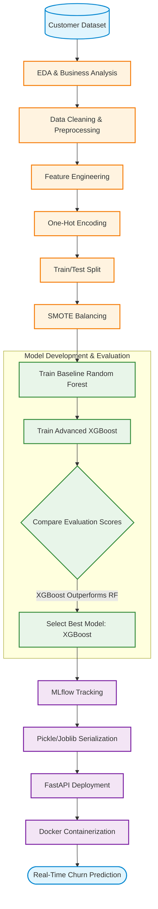
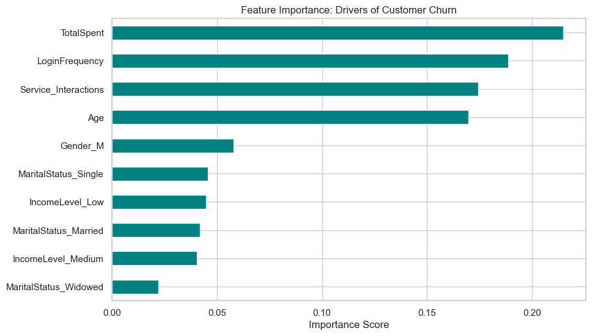
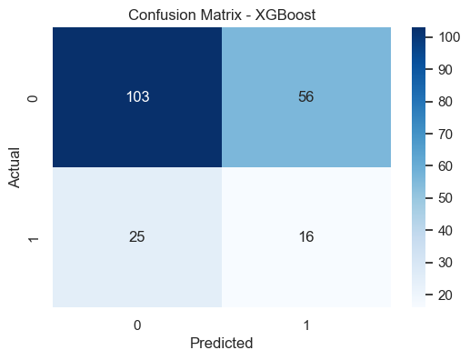
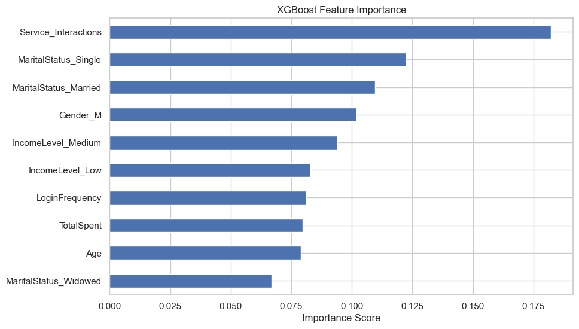
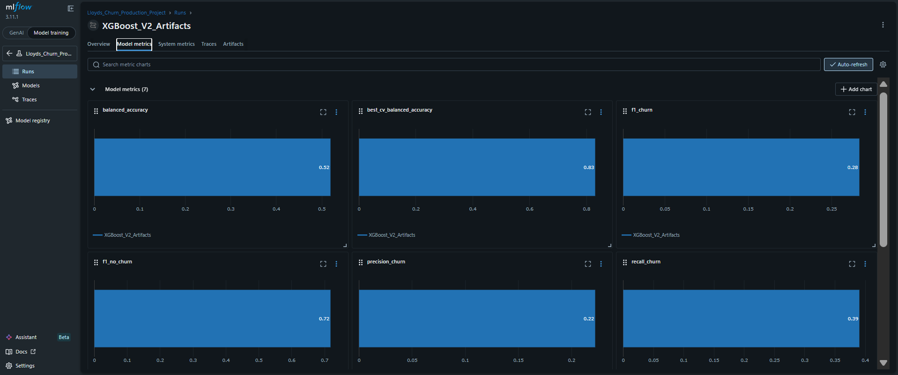
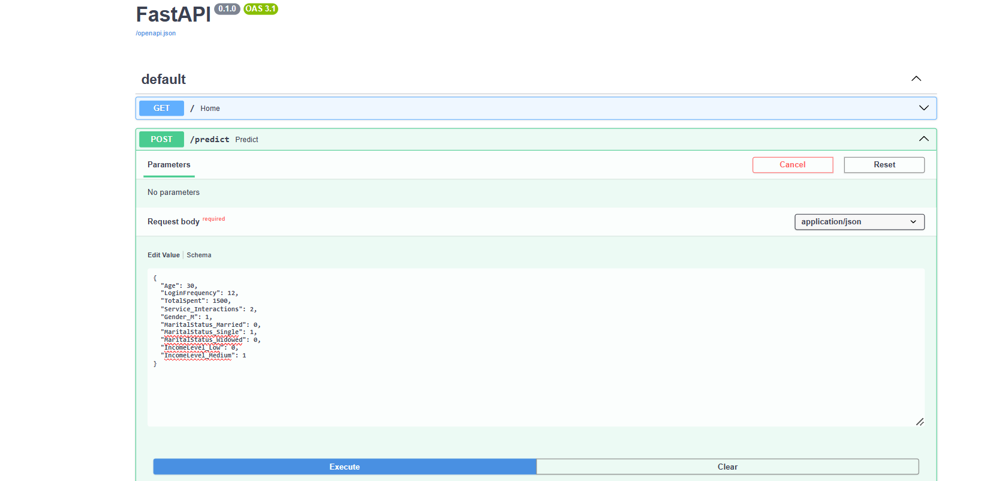
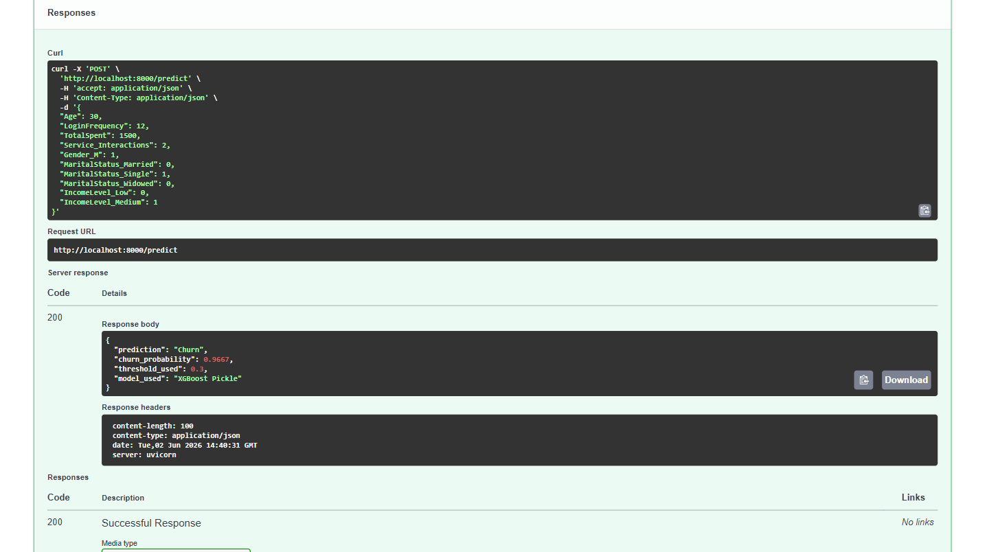
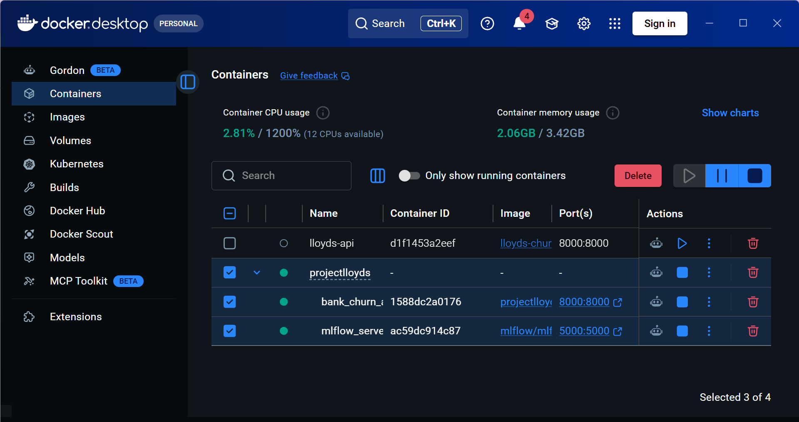

# 🏦 Lloyds Bank Customer Retention & Churn Prediction MLOps Pipeline

## 📌 Project Overview

This project delivers an end-to-end Machine Learning and MLOps solution for customer churn prediction using a Lloyds Banking Group customer dataset.

The objective is to identify customers at risk of churn and support proactive retention strategies through predictive analytics, experimentation, and production-ready deployment.

## 📊 Dataset & Business Problem

Customer churn is one of the most critical challenges in banking.

Retaining an existing customer is significantly more cost-effective than acquiring a new one.

The dataset contains demographic, transactional, and behavioral information for 1,000 banking customers, along with their churn status.

### Target Variable

- Churn = 1 → Customer left the bank
- Churn = 0 → Customer retained

---

## 🔍 Exploratory Data Analysis (EDA)

Several business insights emerged during exploration:

### Digital Disengagement
Customers who churned showed lower login activity compared to retained customers, indicating digital disengagement as an early warning signal.

### Age-Based Risk Segments
Customer churn was concentrated within specific age groups, particularly middle-aged customers.

### Spending Behavior
Total expenditure emerged as a strong indicator of customer value and retention risk.

### Marital Status & Demographics
Demographic characteristics showed measurable differences in churn behavior and were retained for modeling.

### EDA Dashboard

---

## 🛠 Data Preprocessing & Feature Engineering

The following preprocessing pipeline was implemented:

### Data Cleaning

- Missing values handled appropriately
- Duplicate checks performed
- Outlier treatment applied where necessary

### Feature Selection

Removed:

- CustomerID
- Highly redundant variables

Retained:

- Behavioral variables
- Transactional variables
- Demographic variables

### Encoding

Applied One-Hot Encoding to:

- Gender
- Marital Status
- Income Level

---

## ⚖️ Handling Class Imbalance

The dataset exhibited significant class imbalance between churned and retained customers.

Strategies evaluated:

### Random Forest with Class Weights

Implemented cost-sensitive learning through custom class weights.

### SMOTE

Applied Synthetic Minority Oversampling Technique (SMOTE) to improve minority-class representation during training.

---

## 🤖 Model Development

### Model 1: Random Forest

Implemented:

- Stratified Train/Test Split
- Stratified Cross Validation
- GridSearchCV Hyperparameter Tuning
- Cost-Sensitive Learning
- Threshold Optimization

### Random Forest Feature Importance

Although XGBoost was selected as the final deployment model, Random Forest feature importance analysis provided valuable business insights into customer churn behaviour.

---

### Model 2: XGBoost

Implemented:

- Stratified Train/Test Split
- SMOTE Resampling
- StratifiedKFold Cross Validation
- GridSearchCV Hyperparameter Optimization
- Threshold Optimization

Best Parameters:

- Learning Rate: 0.1
- Max Depth: 5
- Estimators: 200
- Subsample: 0.8

---

## 📈 Model Comparison & Final Selection
| Model | Balanced Accuracy | Precision | Recall | ROC-AUC |
|---------|---------|---------|---------|---------|
| Random Forest | 48.67% | 0.19| 0.24 | 0.474|
| XGBoost | 51.90 %| 0.22 | 0.39 | 0.470 |

After comparing both models using Precision, Recall, F1-Score, ROC-AUC, Confusion Matrices, and business utility, XGBoost was selected as the final deployment model.

### Final XGBoost Confusion Matrix

### XGBoost Feature Importance

---

## 🚀 MLOps & Deployment

The final model was operationalized through a complete MLOps workflow.

### MLflow

Used for:

- Experiment Tracking
- Run Management
- Reproducibility

#### MLflow Dashboard

---

### FastAPI

Developed REST endpoints for real-time churn prediction.

Capabilities:

- JSON Input
- Probability Prediction
- Churn Risk Classification

#### Swagger Documentation

#### Live Prediction Output

---

### Docker

Containerized the entire application stack for consistent deployment across environments.

#### Docker Container

---

## 🧰 Technology Stack

### Machine Learning

- Random Forest
- XGBoost
- Scikit-Learn
- SMOTE

### Data Processing

- Pandas
- NumPy

### Visualization

- Matplotlib
- Seaborn

### MLOps

- MLflow
- pickle/Joblib
- FastAPI
- Docker

---

## 🎯 Business Impact

The solution enables:

- Early identification of churn-risk customers
- Data-driven retention campaigns
- Improved customer engagement strategies
- Efficient allocation of retention resources

By combining machine learning with production deployment practices, the project demonstrates how predictive analytics can support customer retention initiatives in the banking sector.

---

## 🔮 Future Improvements

- SHAP Explainability
- Advanced Feature Engineering
- Cloud Deployment
- CI/CD Automation
- Real-Time Monitoring & Drift Detection
