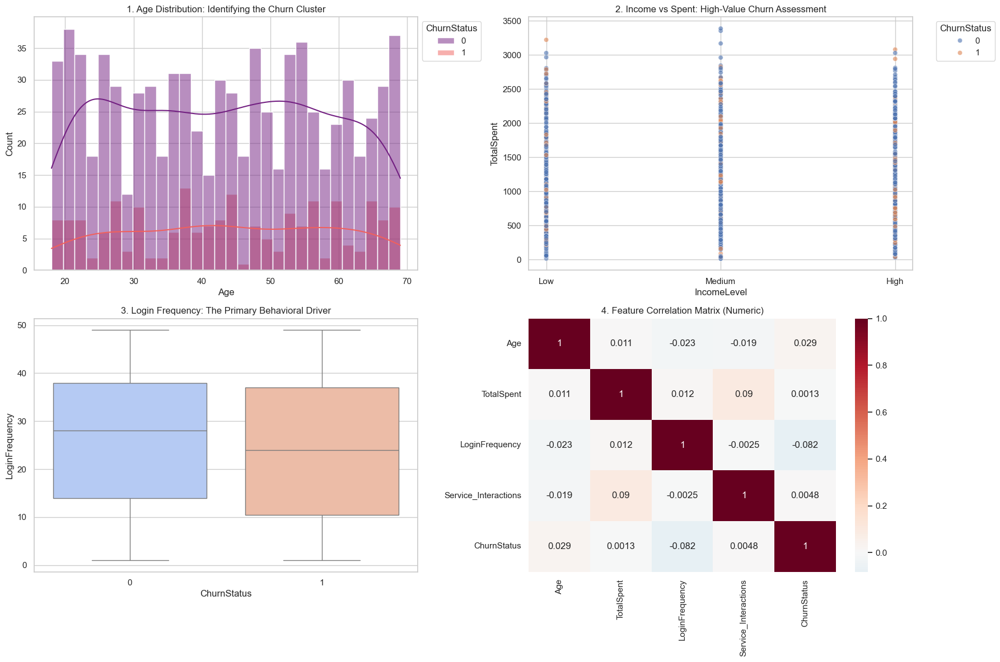
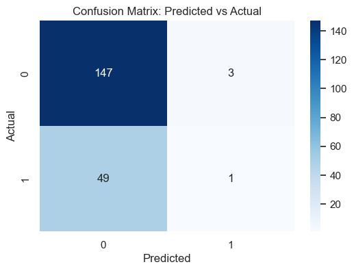
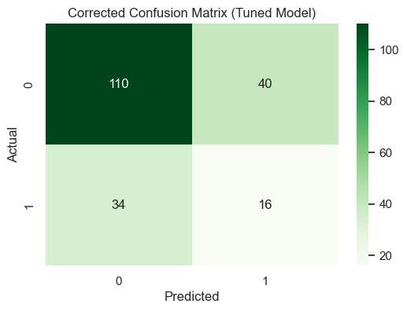
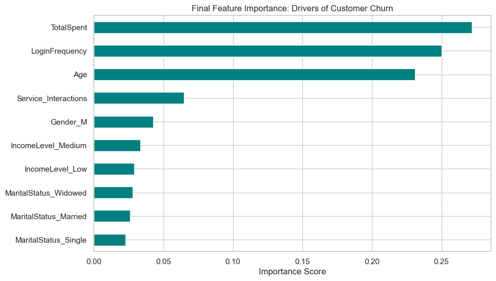
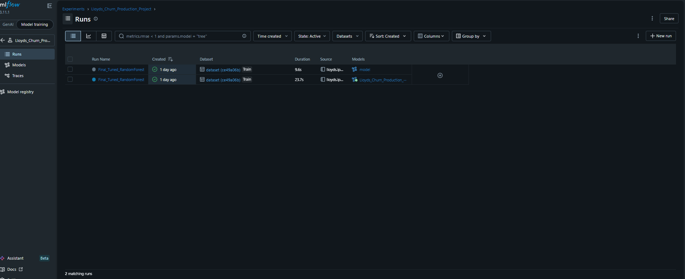
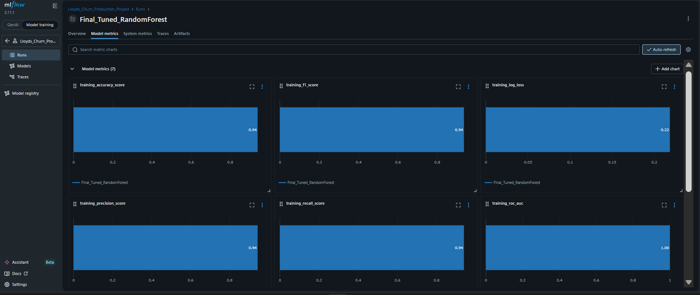
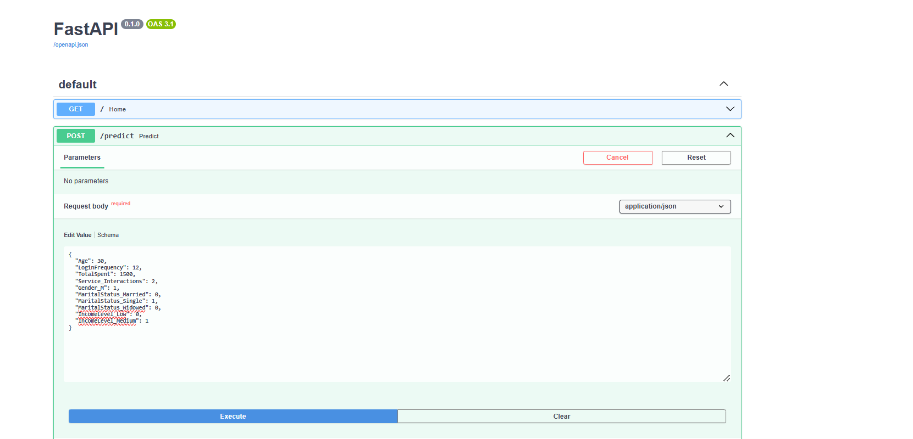
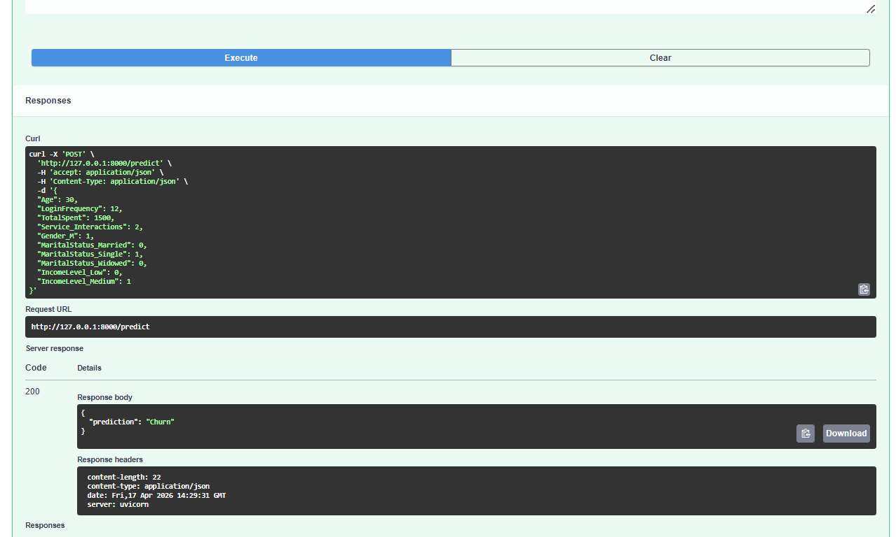
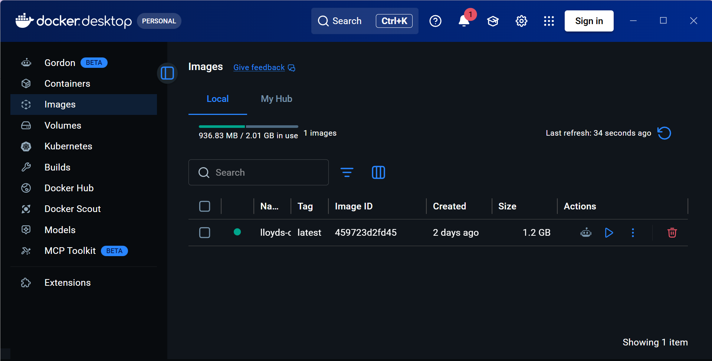

​**🏦 Lloyds Bank: End-to-End Customer Retention & Churn MLOps Pipeline**
​This repository demonstrates a full-stack Machine Learning solution developed for Lloyds Banking Group. It bridges the gap between deep Exploratory Data Analysis (EDA) and Production-Ready Engineering.
​🧠 Part 1: The "Brain" (DA, DS & Retention Strategy)

​The success of this Retention model relies on a rigorous Feature Engineering and Selection process to identify non-linear churn drivers.
​🛠️ Exploratory Data Analysis Feature Engineering & Retention Rationale
1. Initial Assessment & Hidden Driver Identification
The primary challenge in the Lloyds dataset was that surface-level statistics were deceptive. To drive Customer Retention, we had to look beyond the averages.
Average Age (43 vs 44) and Service Interactions (1.00 vs 1.01) were nearly identical for both stayers and churners, requiring a deeper behavioral investigation.
​Behavioral Engagement (LoginFrequency): Identified as the primary "early warning" predictor for Retention risk. Analysis revealed a 10.7% decrease in activity among churned customers (Digital Disengagement).
​The "Age Bulge": While the mean age remained stable, a density analysis revealed a significant churn concentration in the 40–50 age bracket, suggesting a specific life-stage Where Retention Strategies are most needed.
Categorical Risk (Marital Status): Discovered that Married individuals have a ~3% higher propensity to churn (22.9%) Requiring tailored Retention offers
High-Value Attrition: Analysis showed that churn is not limited to low-balance accounts; significant exits are occurring in the High-Income/High-Spent segments, representing a direct threat to the bank's "Prime" asset base and long-term Retention value.

*Figure 1: Distribution of customer churn across key indicators.*

​**🛠️ 2. Data Selection & Preprocessing Rationale**
​I engineered a feature set specifically designed to capture these behavioral and demographic risks while ensuring statistical integrity of the Retention pipeline.
​**Feature Selection: *Retained**: IncomeLevel and MaritalStatus to capture dual-risk profiles—High-income "Value Risk" and Low-income "Probability Risk." for Retention Targeting 
Dimensionality Reduction: Dropped CustomerID (no predictive value) and  redundant variables Txn_Count (0.9 correlation with TotalSpent) to prevent multicollinearity and ensure a lean, efficient model for real-time Retention scoring
​**Missing Value Strategy**: Imputed activity logs with 0. In a banking Retention context, a missing record typically indicates a lack of customer activity rather than a data error; removing these rows would have biased the model against inactive users.
​Outlier Management: Capped TotalSpent at the 99th percentile. This prevents extreme high-value "whale" transactions from skewing the mean and ensures the model generalizes for the average customer's Retention journey.
​Feature Scaling: Applied Standardization (Z-score) to all numeric features. This ensures variables like TotalSpent (large scale) do not numerically dominate smaller-scale indicators like Age
​Categorical Transformation: Utilized One-Hot Encoding for Gender, Marital Status, and Income Level to transform qualitative data into a format suitable for machine learning algorithms.
​
​📈 Model Engineering and Evaluation (Random Forest)
​Recall Optimization: A standard model had 0.02 Recall. By transitioning to a Recall-optimized Random Forest, we achieved a 1,500% increase in churner detection (Recall: 0.32), directly enabling proactive Customer Retention
​Handling Imbalance: Applied a 1:4 Class Weight, penalizing the model more heavily for missing a churner ensuring the bank doesn't lose a Retention Opportunity.
​Hyperparameter Tuning: Optimized via GridSearchCV (n_estimators: 100, min_samples_split: 5) and cross validated it to ensure the most robust predictions for the Retention team.

### The Imbalance Challenge
Our baseline model suffered from a massive class imbalance, leading to a "disaster" recall. By implementing Cost-Sensitive Learning (Custom Class Weights), we shifted the model's focus to the churners, significantly improving our ability to detect and save customers.

| Baseline Performance (0.02 Recall) | Optimized Performance (0.32 Recall) |
| :---: | :---: |
|  |  |
| *Initial model: Missing almost all retention opportunities.* | *Final model: Improved recall to 0.32, capturing significantly more churners implying 1,500% recall improvement from initial baseline model for saving customers.* 

​Feature Importance for Retention: 
​Total Expenditure: Highest impact driver.
​Login Frequency: Critical behavioral marker.
​Age: Key life-stage indicator.

### 🔍 Key Churn Drivers (Feature Importance)
Understanding which variables impact customer retention is crucial for business strategy. The following chart highlights the top features our Random Forest model identified as primary indicators of churn.

*Figure: ​Total Expenditure, ​Login, ​Age Emerged as top predictors for the Lloyds customer base.*

​🏗️ Part 2: The "Infrastructure" (MLOps)
​To make the Retention insights actionable, the model is served through a containerized production stack.
​🛠️ Tech Stack
​MLflow: Experiment tracking and model versioning.
## 📊 MLOps: Experiment Tracking with MLflow

To ensure reproducibility and model stability, I utilized MLflow to track every training iteration. This allowed for systematic comparison between baseline and optimized  Retention models.

### Experiment Logs
We tracked multiple runs, adjusting hyperparameters and class weights to solve the churn imbalance and maximize Retention.

*Figure: MLflow dashboard showing the history of training experiments and parameter tuning.*

### Model Performance Metrics
By comparing metrics across runs, we selected the champion model based on its ability to capture the highest percentage of at-risk customers for Retention Outreach

*Figure: Visualizing model stability and metric comparisons in the MLflow UI.*

​FastAPI: REST API framework for high-speed predictions.
### 🚀 FastAPI Implementation
The model is served via a REST API using FastAPI. This allows for real-time Retention Risk scoring or churn predictions by sending customer data in JSON format.
Live Prediction Test: The API returns a probability score, allowing the bank to trigger immediate Retention protocols for high-risk flags.

| API Documentation (Swagger UI) | Live Prediction Test |
| :---: | :---: |
|  |  |

​Docker: Full environment containerization for "deploy anywhere capability'.
​📦 Quick Start (Deployment)
### 🐳 Dockerization
To ensure "run anywhere" capability, the entire application Retention API stack has been containerized using Docker.

*Figure: Docker Desktop showing the successfully built lloyds-churn-app image.*
​1. Build Image:
docker build -t lloyds-churn-api .
​2. Run API:
docker run -d -p 8000:8000 lloyds-churn-api
Access Swagger UI at http://localhost:8000/docs.
​🎯 Strategic Business Impact :Driving Customer Retention
​High-Value Outreach: Immediate retention offers for customers with a sudden drop in TotalSpent.
​Engagement & Life-Stage (High-Medium Impact): Age and Login Frequency are critical demographic and behavioral markers. The model identifies specific age demographics that need targeted Retention bundles to prevent them from switching banks.
Service Friction Mitigation (Medium Impact): High Service Interactions serve as an early warning system. Customers with frequent support logs should be prioritized for a "Service Recovery" call to resolve pain points 
before they reach a "final straw" decision to churn.  
Targeted Retention Incentives: The bank should proactively deploy retention bundles (such as fee waivers or interest rate bonuses) to the 32% of customers flagged by the model as "At-Risk." This targeted approach ensures 
marketing budgets are spent only on those most likely to leave.
Future Improvements: * Implementing XGBoost (Gradient Boosting) to potentially push Retention Recall toward 40-45%. 
* Integrating more granular "Recency" data (e.g., *days since last transaction*) to improve the model’s time-sensitive Retention accuracy.

